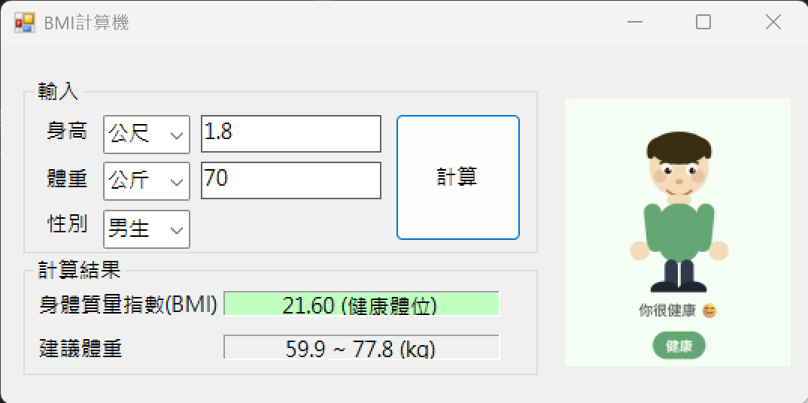

# BMI計算機
這是一個簡單的BMI計算機，使用者可以輸入自己的體重和身高，程式會計算出BMI值並告訴使用者他們的體重狀況。
## 使用方法
1. 開啟.exe檔
2. 輸入身高（公尺 / 呎）
3. 輸入體重（公斤 / 磅）
4. 要記得選擇正確的單位
5. 選擇性別 （男 / 女）
6. 按下「計算」按鈕
7. 程式會顯示BMI值和體重狀況
8. 下方的建議體重會將根據使用者的身高和BMI值計算出建議的體重範圍
9. 右方會顯示狀態體重，共有六種狀態，如下方圖示
```
備註：
可以使用tab鍵進行輸入，有調整好tableindex。
```
 
 
 
